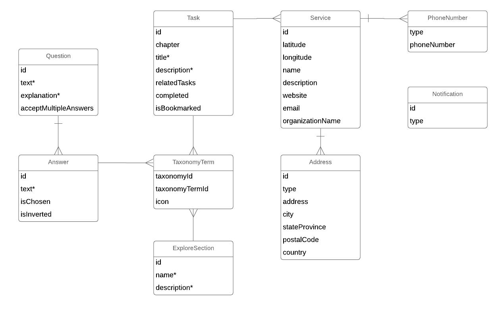

# Pathways frontend

This repository contains the client for providing access to data about services for refugees and immigrants to BC.

The client is implemented in react-native, using create-react-native-app, redux, redux-first-router, native-base and lingui.

# Getting started

## Initial setup and build

With a fresh repository, this will get the application compiled and running on Expo:

Install dependencies

```
yarn install
```

Copy example configuration file and modify accordingly (set your own API host, Sentry auth token etc).
```
cp .env.example .env
```

Compile TypeScript, optionally watch source files for changes and build them automatically

```
yarn build [--watch]
```

Run tests, optionally watch source files for changes and run the tests automatically

```
yarn test [--watch]
```

Build and start Expo to run the app in a simulator or on an actual Android or Apple device, optionally clear cache

```
yarn start [-c]
```

To clear out cached values from `.env`, use `--reset-cache`.

## Internationalization (i18n)

We are using [jsLingui](https://github.com/lingui/js-lingui) and [Weblate](https://weblate.org) for translation and internationalization. We translate strings through our own Weblate application here: [translate.peacegeeks.org](https://translate.peacegeeks.org). The source strings for Arrival Advisor, as well as information on how we integrate Weblate into our workflow can be found here: [https://github.com/tomy-pg/ui-strings](https://github.com/tomy-pg/ui-strings). 

To update the in app translations: 

1. `git clone git@github.com:tomy-pg/ui-strings.git` to retrieve the translated strings. This is the source of truth for all strings translated using Weblate.  

2. `cd pathways-frontend` and run `./bin/strings --combine-pos`. This command expects the `../ui-strings` directory from step 1 to exist and will not work without it. Once this command is run, a messages.po file will be generated for each locale. Each of these files contain pairs of English source strings and their translated versions. 

3. `yarn build-strings` to generate compiled versions of the messages.po files. The `messages.js` files generated are the source catalogs Lingui uses for internationalization. Source catalogs are used to lookup translations when English strings are wrapped with `<Trans>` tags.

## Entities

These are the entities of the client side data model:



## Contributing

If you want to help out, get in touch at info@arrivaladvisor.ca.

### Commit messages

All commits are labelled with the issue they are being done under. This ensures that we don't do work that is not tracked, and history of why every change is made is maintained. Most front end and back end work is tracked by issues in their respective repositories, in which case the commit message should start with "Issue #N", e.g. "Issue #13". Occasionally, front end work may be tracked under backend issues, in which case each commits message should start with "Issue pg-irc/pathways-backend#13".

## Versioning

* Client and server are versioned independently.
* Client specifies the minimum server version required for proper client operation.
* We use [semantic versioning](https://semver.org/) of the form X.Y.Z.
* We start with version 1.0.0 for client and server.
* The version string of the client or server is done in the same pull request that contains the changes that require the version to change.
* We bump the Z each sprint, except for sprints where no changes went in. We also bump Z for any hotfixes that may go in independenty of the sprint cadence.
* We bump the Y when we add features that are backwards compatible as per semantic versioning.
* We bump the X when we add features that are backwards incompatible, i.e. when the client would fail to operate correctly with an older server version, as per [semantic versioning](https://semver.org/).
* Versions are stored as git tags in each git repo (client and server).
* On the server side, the version is stored in VERSION.txt.
* On the client side, the version is stored in VERSION.txt and several other files, with unit tests making sure that all version strings are the same.
* Client About screen shows the version of the client.

## Expo SDK updates

This is a managed Expo application so we should let Expo update its dependencies before we apply non Expo updates. Always reference: https://docs.expo.io/versions/latest/workflow/upgrading-expo-sdk-walkthrough/ prior to performing an update. This is the approach we've been using:

1. Update the Expo CLI: `$ npm install -g expo-cli`

2. Install the newest Expo SDK: `$ expo update {EXPO_SDK_VERSION}`

3. Test and fix any breakage due to Expo updates

## Non Expo package updates

It's suggested you first apply [Expo SDK updates](#expo-sdk-updates) then non Expo updates. Once you feel you're not going to compromise any of Expo's dependencies run:

1. `yarn outdated` and review available upgrades

2. `yarn upgrade {package-name}`to upgrade specific packages

## Changelog

Changes that are made in each release are tracked following [Expo's](https://github.com/expo/expo/blob/master/CHANGELOG.md) procedure. 


* changelog is updated with every PR that affects functionality.
* a new heading is added to the changelog as part of every PR that bumps version strings.

## Big Thanks

Cross-browser Testing Platform and Open Source <3 Provided by [Sauce Labs][SauceLabsURL]

[SauceLabsURL]: https://saucelabs.com
